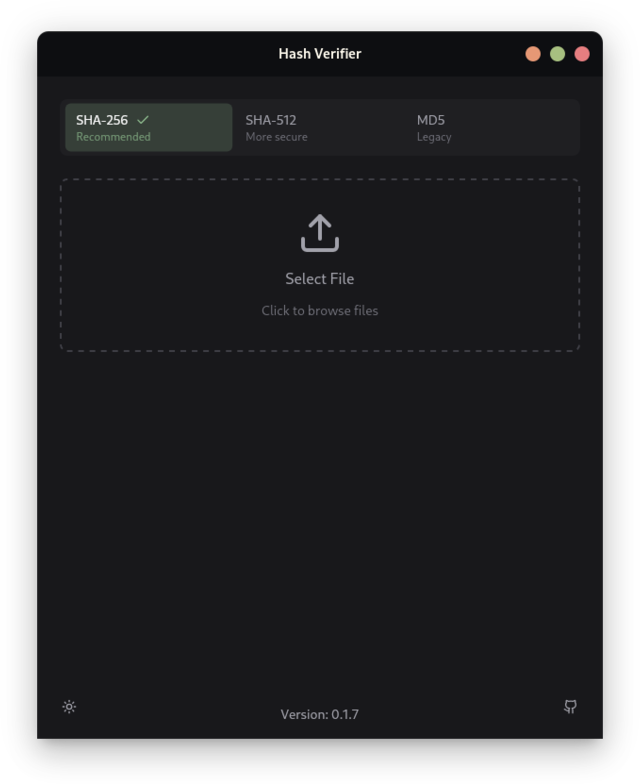
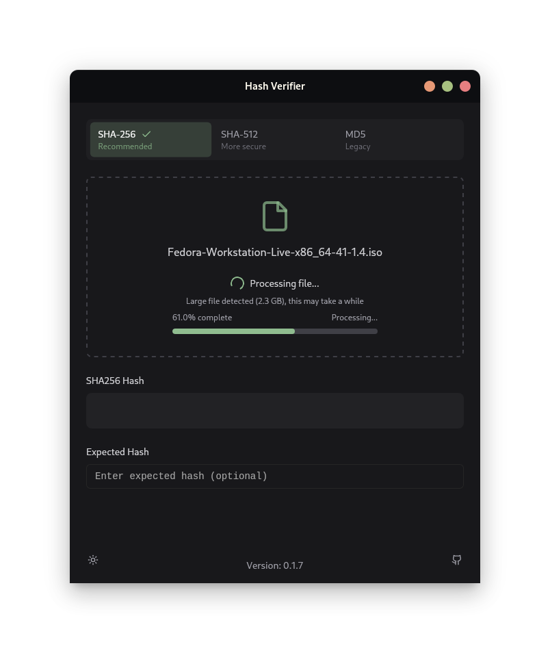

# A simple GUI made with Tauri for hashing
# Hash Verifier GUI
A simple, modern GUI tool for calculating and verifying file hashes. Supports SHA-256, SHA-512, and MD5.

# Images

<div style="display: flex;">
    
    
</div>

## Installation

### Windows
**Via Scoop (Admin Privileges Required):**
```powershell
# Add the bucket (only needed once)
scoop bucket add LunarisScoop https://github.com/Team-Lunaris/ScoopBucket
# Install Hash Verifier
scoop install Hash-Verifier-GUI
```

### Linux
**Via Flatpak:**
```bash
flatpak install com.hashverifier.app
```

**Via Package Managers:**
```bash
# Debian/Ubuntu
sudo dpkg -i hashverifier_0.1.7_amd64.deb

# Fedora/RHEL
sudo rpm -i hashverifier-0.1.7.x86_64.rpm
```

## Features
- Calculate SHA-256, SHA-512, and MD5 hashes
- Real-time hash verification
- Dark/Light theme support
- Progress tracking for large files
- Copy hashes to clipboard

Download the latest release from our [releases page](https://github.com/IIRoan/Hash-Verifier-GUI/releases).